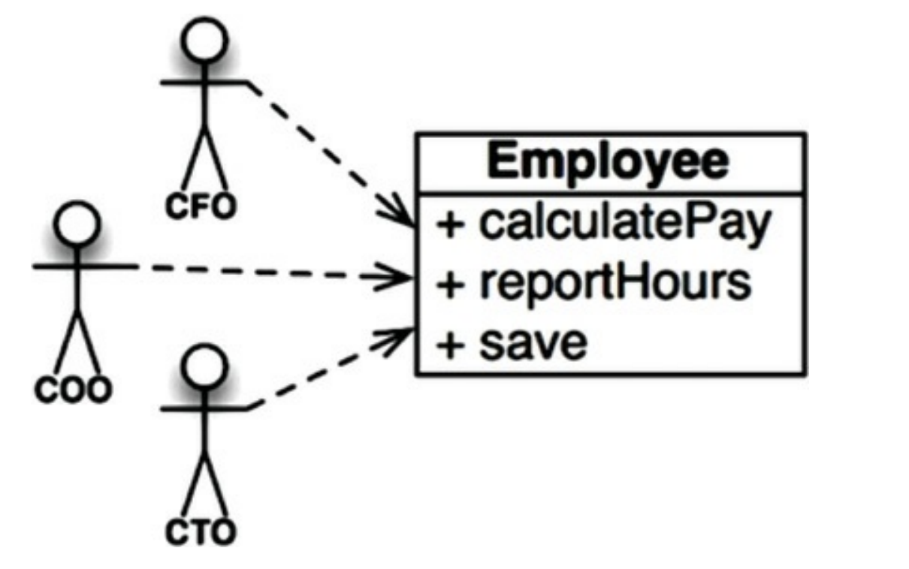
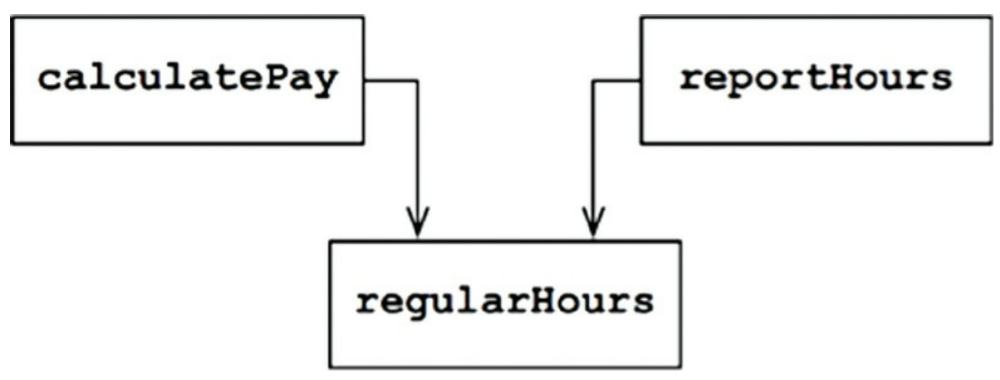
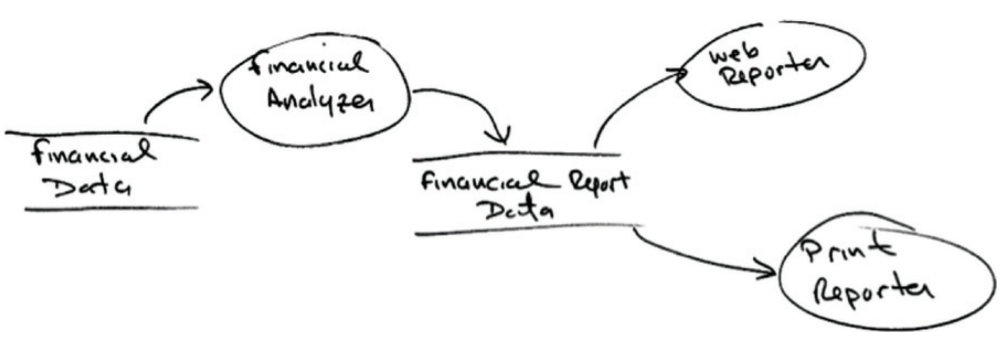
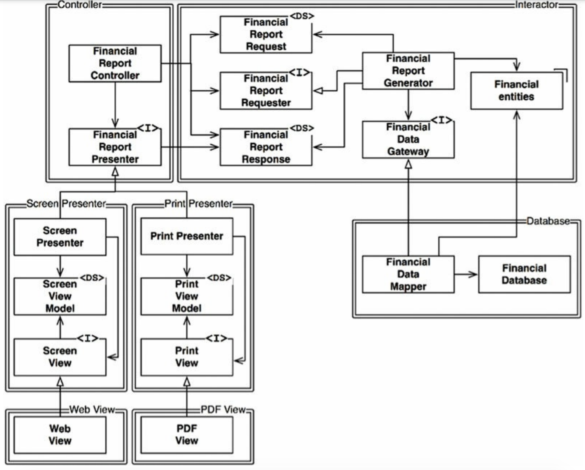
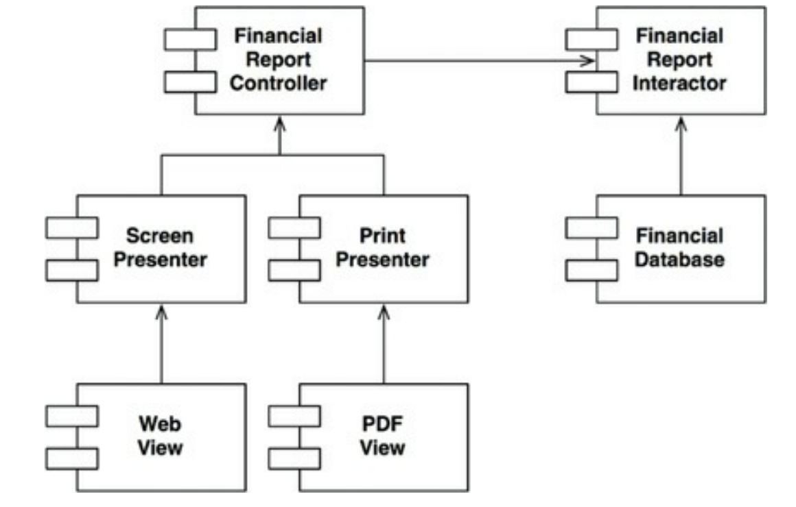

# Part 3 - Design Principles

Good software systems begin with clean code. If your bricks aren't well made, the architecture of a house doesn't really matter.

On the other hand, you can make a substantial mess will well-made bricks.

That's where the SOLID principles come into play. Their goal is the creation of mid-level software structures that:
 * Tolerate change
 * Are easy to understand
 * Are the basis of reusable components

They aren't confined to object-oriented programming or classes. Rather, they are applicable to any notion of a "component".
These principles are applied to mid-level components, meaning just one level above the level of the code.

However, they aren't sufficient for a good architecture as one can make a substantial mess with good mid-level components.

The executive summary of the principles is:
 * Single Responsibility Principle (SRP)
   * Every class should have exactly one reason to change
   * In other words, there should be only one person/group of people who would like to change it.
 * The Open-Closed Principle (OCP)
   * In order for software components to be easy to change, their design should be made such that changes are applied by adding new code, not changing existing code
 * The Liskov Substitution Principle (LSP)
   * The gist of this principle is that in order to build systems from interchangeable parts, those parts must adhere to a contract in a way that they can be easily changed without this affecting the rest of the code
 * The Interface Segregation Principle (ISP)
   * Don't depend on things you don't need
 * The Dependency Inversion Principle (DIP)
   * The code that implements high-level policy should not depend on the code that implements low-level details. It is the details which should depend on the policies

## The Single Responsibility Principle

SRP is the least well understood principle as it is very easy to confuse it for:
> A module should do exactly one thing

That's not what SRP is about. The official definition is:
> A module should have one, and only one, reason to change

A "reason to change" refers to the user or stakeholders which might want to change something.
However, users & stakeholders aren't a good formal definition, so a better word would be "actor":
> A module should be responsible to one, and only one, actor.

The reason for us to want to adhere to this principle is to make sure that if different teams/people working on different tasks don't modify the same classes/modules.
If we let this happen, there is a possibility that when someone makes a change in a class to satisfy stakeholder A, it might accidentally make changes to the behavior demanded by stakeholder B.

Here are several symptoms which signal the violation of this principle:

### Symptom 1: Accidental Duplication
Say we have an `Employee` class with three methods:

This class is a violation of SRP as the three methods adhere to different actors:
 * `calculatePay()` adheres to requirements specified by the accounting department
 * `reportHours()` adheres to requirements from the HR department
 * `save()` adheres to requirements from the DBAs

With such a structure, here's an example bad scenario:

`reportHours()` and `calculatePay()` use the same shared function `regularHours()` which mandates the calculation of a user's regular hours.

If the HR department want to change the way the regular hours are calculated, one might go to this class, change the shared function, carefully test it and satisfy the new requirements laid out by HR.

However, since this function is also used by the `calculatePay()` method, which is used by accounting, you've accidentally changed the way regular hours are calculated from an accountant's perspective, resulting in wrong documents, which can lead to huge liability risk and/or incident expenses.

### Symptom 2: Merges
If there's a merge conflict since two developers, possibly from different teams, have changed the same source file, then this probably indicates a violation of SRP.

If a class adheres to a single actor, developers from different teams shouldn't have a need to modify the same file.

### Solutions
An example solution to this problem is to separate the functions from the data:

This way, there is a single data structure class `Employee`, which is used by three different classes, adhering to different actors.

The problem with this approach is that we now have to keep track of instantiating three more classes, instead of focusing on instantiating a single class.

This problem can be alleviated by using the `Facade` pattern:

## The Open-Closed Principle
> A software artifact should be open for extension but closed for modification

In other words, a software component should be extendible without having to modify that component.

Why is this important?

If small extensions in requirements force massive changes throughout the codebase, then there is clearly an architectural issue.
The purpose of this principle is to guide you in designing your system in a way that extensions to requirements can be satisfied by adding additional code, not by changing existing code.

### A thought experiment
Say we are given a system that displays financial summary on a web page.
Stakeholders come and want us to extend the system to support printing the same info on a PDF to be printed.

A good architecture would allow this to be achieved by only adding additional code, not changing existing code.
A sidenote here is that, of course, some code will have to be changed - e.g. the wiring-related code which creates class instances, but that should be a small, isolated part of the system.

This can be achieved by properly separating things that change for different reasons (SRP) and properly organizing dependencies between these components (DIP).

The provided solution is:

The main insight is that the classes responsible for calculating the data need to be different from the classes displaying it.
Additionally, the source code dependencies need to be organized in a way that changes to one of these responsibilities doesn't cause changes in the other one.

The full design of the system:

One thing to notice is that all dependencies between components are unidirectional:

The higher-level components (e.g. Interactor) know nothing about the lower level components which implement the higher-level interfaces.
If we want to protect a component A from changes in component B, then component B should depend on component A, not the other way around.

In this diagram, the Interactor is the highest-level component, which holds the business rules. It should be protected from changes in any other component.
The Controller, on the other hand, is dependent on the Interactor, but is protected from changes in the Presenters and the Views.

This dependency chain should flow from the highest-level components to the lowest-level ones.

## The Liskov Substitution Principle

